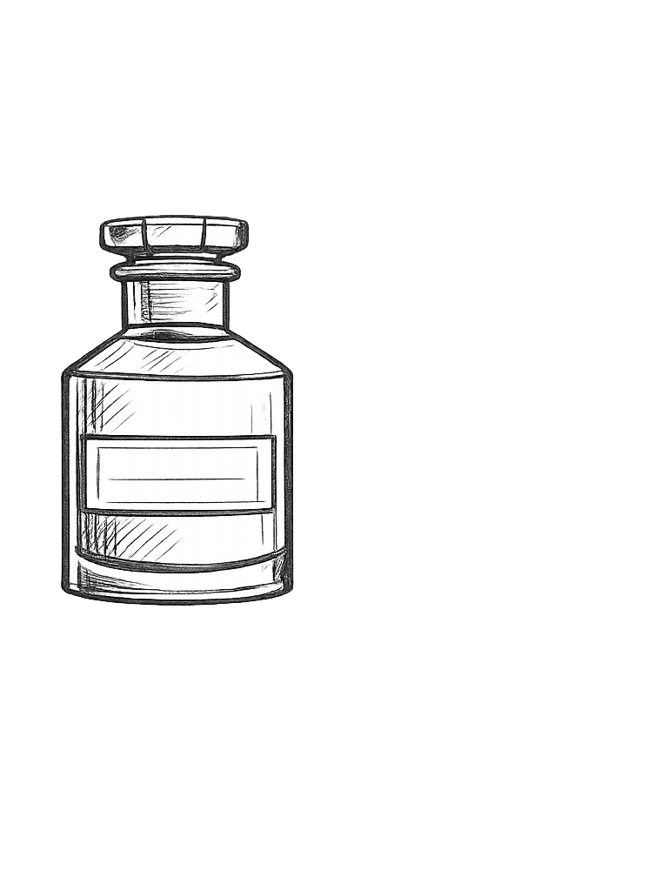

# Le Labo City Exclusives 

  

_An independent catalog of Le Labo City Exclusives._

This project looks at City Exclusives through place first, then scent.  
Each entry links a city to its fragrance in a clean, direct way.

It is meant for daydreaming, not shopping.
---

## Purpose

I built this because I am drawn to what makes a place unique.  
When I travel, I pay attention to details that do not translate elsewhere.  

---

## Views

- Ring
- Dial
- Sqr
- Map

Each offering a different way to explore the relationship between city and scent. I guess.

---

## Disclaimer

Not affiliated with Le Labo.

---

Raised in Vanille 44, living the Tubereuse 40 life.
